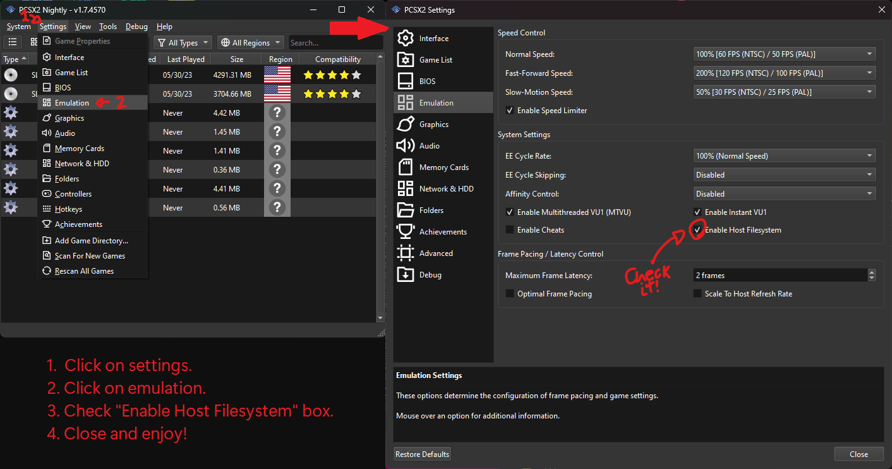

---

# BurnTrack PS2 DEMO - AthenaEnv

    

Before diving into the details of this project, I would like to extend a big thank you to **Daniel Santos** for creating the incredible engine **AthenaEnv** and for continuously improving it every day. Thanks to his work, homebrew development for the **PlayStation 2** has become more accessible and powerful.

## About the Project

This is a **demonstration** of a car game using **AthenaEnv**. The main objective of this project is to **teach** and demonstrate the capability of creating games for the **PlayStation 2** using this engine.

The project serves as a foundation for learning, allowing developers to explore concepts such as:

- 3D rendering
- Camera manipulation
- Controls and movement

## Requirements

To run this demo, you need:

- If you are opening it on PlayStation 2, just open the `.elf` file normally through uLaunchELF.
- If using PCSX2, you need to activate **hostfs** and open the elf.
  
 

---

## Contributions

If you would like to contribute improvements, feel free to open a **pull request** or report any related **issues** with the project.

## Credits

- **Demo Development:** ps2devnoob
- **Engine:** [Daniel Santos](https://github.com/DanielSant0s/AthenaEnv/)

---

If you enjoyed the demo, don’t forget to leave a ⭐ on the repository and check out other projects using **AthenaEnv**!

---
